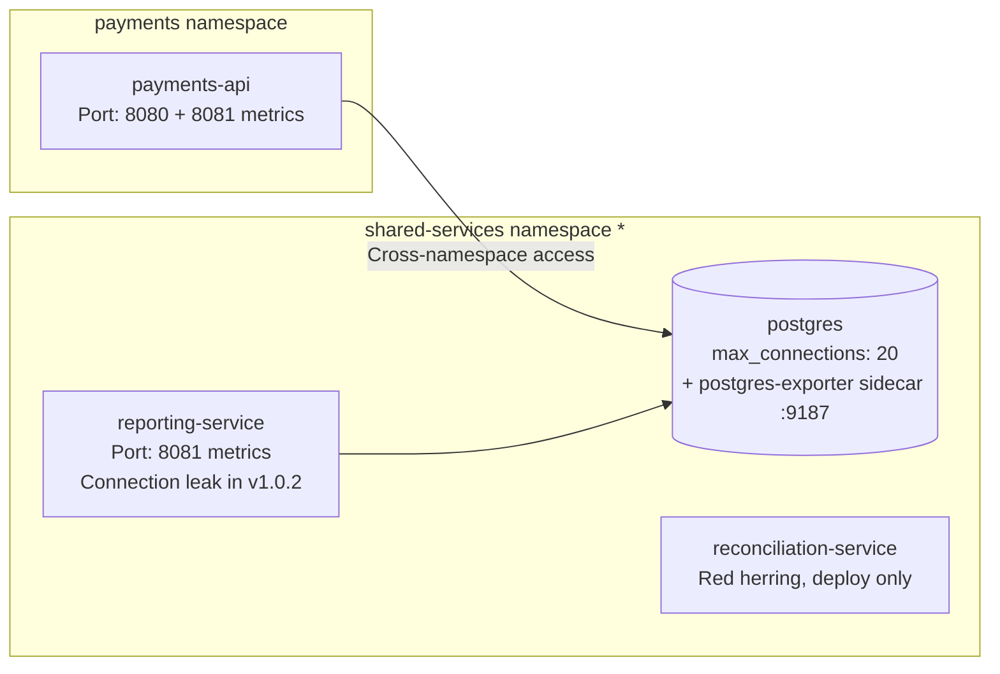

# Scenario: Payments API failure

## Overview

A routine service upgrade introduces a subtle database connection leak that exhausts shared infrastructure.

The reporting service rolls from a healthy v1.0.1 to a buggy v1.0.2 that never closes database connections, rapidly filling PostgreSQL's connection pool and causing the payments API to fail with HTTP 503 errors.

The AI assistant must correlate the deployment event with the failure and trace the connection leak to its source.

## Usage

```bash
oc login ...                # required

make deploy-easy            # easy mode (single namespace, fewer distractors)
# or
make deploy                 # hard mode (two namespaces, shared DB user, more alerts, red herring)

sleep 5m                    # optional, let metrics accumulate
make break                  # roll out buggy v1.0.2
```

### Difficulty Modes

| | `deploy-easy` | `deploy` |
|---|---|---|
| Namespaces | single (`payments`) | two (`payments`, `shared-services`) |
| DB users | per-service (`payments`, `reporting`) | shared (`dbuser`) |
| Alerts | 1 critical (payment), 1 warning (DB connections) | 2 critical (payment + DB), 2 warning (payment + DB) |
| Red herring | none | `reconciliation-service` in CrashLoopBackOff |

`deploy` also accepts `SINGLE_NAMESPACE=1` to collapse into one namespace while keeping the other hard-mode traits.

### Suggested Prompts

```
why are payments api and database failing? investigate and check correlation

identify recent changes before the incident
```

## The Root Cause

A deployment rollout updates the reporting service from v1.0.1 to v1.0.2, which introduces a connection leak bug.

## Components



\* In easy mode and `SINGLE_NAMESPACE=1`, everything deploys to `payments`.

| Service | Image | Purpose |
|---------|-------|---------|
| `payments-api` | Custom (Python/FastAPI) | Core payment processing API. Runs a background traffic simulator and exposes `GET /api/v1/process-payment`. Shares database with reporting-service. |
| `reporting-service` | Custom (Python) | Periodically queries the reports table. v1.0.1 (healthy) and v1.0.2 (buggy). |
| `reconciliation-service` | `registry.redhat.io/rhel9/httpd-24:latest` (stock) | Red herring, `deploy` only. Overridden command exits immediately, always in CrashLoopBackOff. |
| `postgres` | `postgres:16` + `postgres-exporter:v0.15.0` sidecar | Shared database. Initialized with `max_connections = 20`. Sidecar exposes connection metrics on port 9187. |
