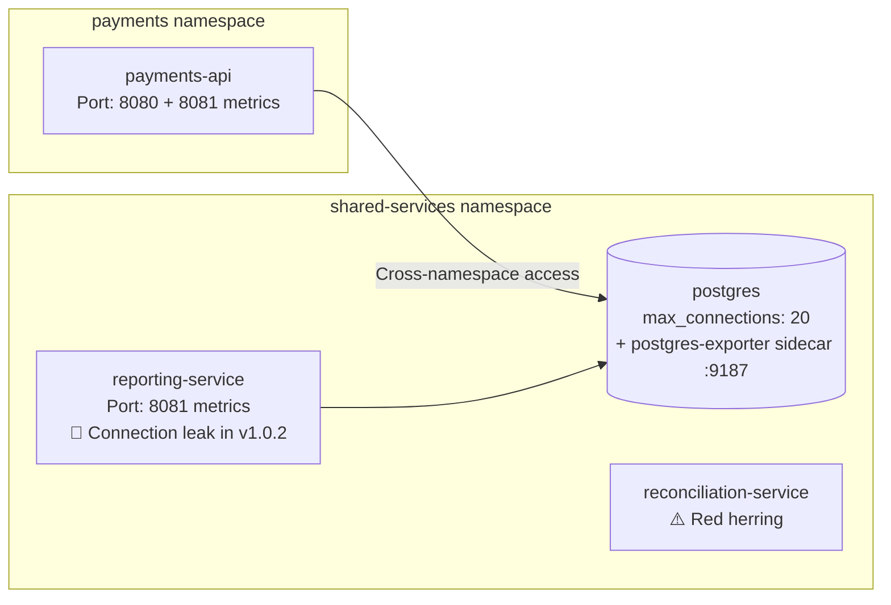

# Scenario: Payments API failure

## Overview

A routine service upgrade introduces a subtle database connection leak that exhausts shared infrastructure across namespaces. 

The reporting service rolls from a healthy v1.0.1 to a buggy v1.0.2 that never closes database connections, rapidly filling PostgreSQL's connection pool and causing the payments API in a separate namespace to fail with HTTP 503 errors. 

The AI assistant must correlate the deployment event with the cross-namespace failure and trace the connection leak to its source.

## Usage

```bash
export OPENAI_API_KEY=...   # required
oc login ...                # required

make deploy
sleep 5m                    # optional, but recommended
make break                  
```

### Suggested Prompts

```
why are payments api and database failing? investigate and check correlation

identify recent changes before the incident
```

## The Root Cause

A deployment rollout updates the reporting service from v1.0.1 to v1.0.2, which introduces a connection leak bug.

## Components

**Namespaces:** `shared-services` and `payments`



| Service | Image | Purpose |
|---------|-------|---------|
| `payments-api` | Custom (Python/FastAPI) | Core payment processing API. Runs a background traffic simulator and exposes `GET /api/v1/process-payment`. **Appears independent but shares database.** |
| `reporting-service` | Custom (Python) | Periodically queries the reports table. Has two versions: v1.0.1 (healthy) and v1.0.2 (buggy). |
| `reconciliation-service` | `registry.redhat.io/rhel9/httpd-24:latest` (stock) | Reconciliation service. **Red herring** — overridden command exits immediately, always in CrashLoopBackOff. |
| `postgres` | `postgres:16` + `postgres-exporter:v0.15.0` sidecar | Shared database for both services. Initialized with `max_connections = 20`. Sidecar exposes connection metrics on port 9187. |
