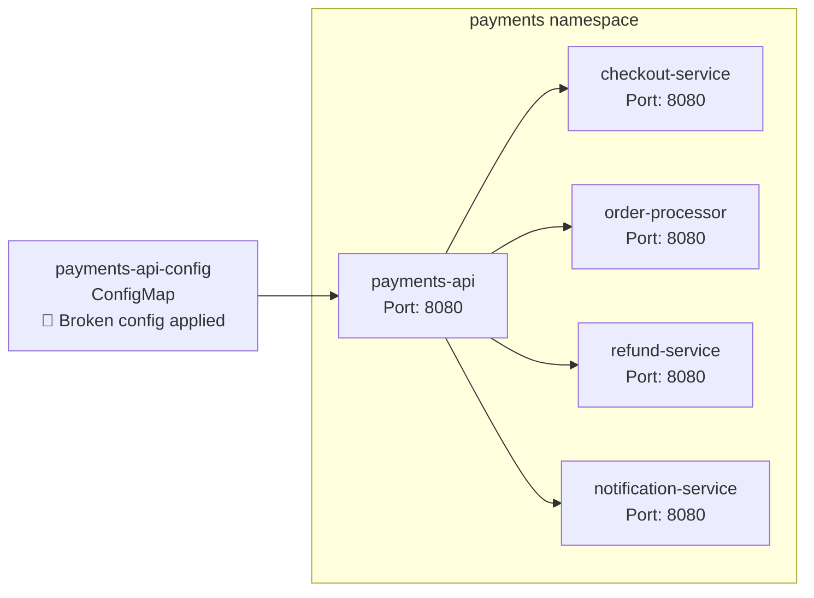

# Scenario: Alert Storm

## Overview

A broken ConfigMap is applied to the central `payments-api` service, causing it to fail. Four downstream services that depend on it degrade in cascade, triggering a storm of alerts that obscures the simple root cause.

## Usage

```bash
oc login ...                # required

make deploy
make break                  
```

## The Root Cause

A broken ConfigMap is applied to `payments-api`, causing it to crash. All four downstream services fail in cascade because they depend on `payments-api` via HTTP.

## Components

**Namespace:** `payments`



| Service | Image | Purpose |
|---------|-------|---------|
| `payments-api` | Custom (Python/FastAPI) | Central payment processing API. Loads config from a mounted ConfigMap. **Root cause lives here.** |
| `checkout-service` | Custom (Python/FastAPI) | Polls payments-api every 2s. Degrades after 3 consecutive failures. |
| `order-processor` | Custom (Python/FastAPI) | Generates orders every 1s, calls payments-api. Queues failed orders for retry. |
| `refund-service` | Custom (Python/FastAPI) | Validates refund eligibility via payments-api every 2s. Queues pending refunds. |
| `notification-service` | Custom (Python/FastAPI) | Polls payments-api every 3s to deliver payment notifications. |
