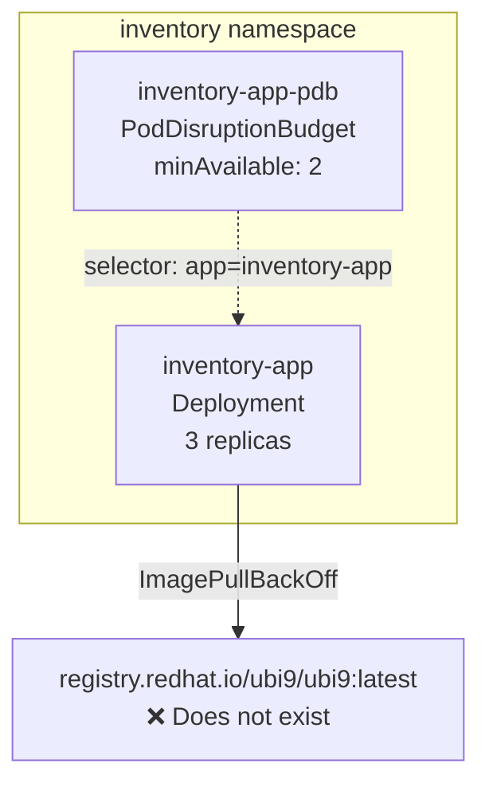

# Scenario: Image Pull Failure

## Overview

A Deployment with 3 replicas is running a simple inventory service backed by a Red Hat UBI image. A typo is introduced in the container image reference (`ubi9` instead of `ubi`), causing all pods to enter `ImagePullBackOff`. A PodDisruptionBudget requiring at least 2 healthy pods can no longer be satisfied, triggering the platform-level `PodDisruptionBudgetLimit` alert.

## Usage

```bash
oc login ...                # required

make deploy                 # deploy healthy state (3 running pods, PDB satisfied)
make break                  # introduce image typo, wait for PDB alert to fire
make fix                    # restore correct image
make cleanup                # delete all resources
```

## The Root Cause

The Deployment's container image is changed from `registry.redhat.io/ubi9/ubi:latest` to `registry.redhat.io/ubi9/ubi9:latest` — a subtle copy-paste typo (`ubi9` instead of `ubi`). The image does not exist, so all pods fail to pull it and enter `ImagePullBackOff`. With zero healthy pods, the PodDisruptionBudget (`minAvailable: 2`) is violated and the platform alert fires.

## Components

**Namespace:** `inventory`



| Resource | Name | Details |
|----------|------|---------|
| Deployment | `inventory-app` | 3 replicas, image `registry.redhat.io/ubi9/ubi:latest` (healthy) |
| PodDisruptionBudget | `inventory-app-pdb` | `minAvailable: 2` — triggers platform `PodDisruptionBudgetLimit` alert when violated |
| PrometheusRule | `inventory-alerts` | `InventoryPodImagePullBackOff` warning alert (fires after 30s of ImagePullBackOff) |

## Alerts

| Alert | Source | Severity | Fires after | Condition |
|-------|--------|----------|-------------|-----------|
| `InventoryPodImagePullBackOff` | User workload (PrometheusRule) | warning | ~30s | Pod container stuck in `ImagePullBackOff` |
| `PodDisruptionBudgetLimit` | Platform (built-in) | critical | ~15m | `currentHealthy < desiredHealthy` on the PDB |
